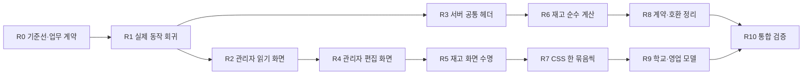

# 급식길 동작 보존 리팩토링 실행 계획

> **For agentic workers:** 먼저 이 문서와 연결된 spec/감사/기준선을 읽는다. 사용자가 준비 작업을 위임했으므로 실행 방식 재선택 질문은 생략한다. 기본 제공 Codex agent로 독립 분석·검토하되 같은 파일의 동시 수정은 피하고 아래 의존 순서와 검증 기준을 따른다. 외부 Superpowers 실행 플러그인 전체는 이 계획의 필수 의존성이 아니다.

**Goal:** 현재 사용자 경험·보안·데이터 호환·성능을 보존하면서 큰 화면과 서비스의 책임을 나눠 변경 영향과 회귀 위험을 줄인다.

**Architecture:** 기존 feature 구조, Firebase Callable/transaction 경계, Next 정적 export, 명시적 캐시 수명을 유지한다. 읽기 화면·순수 계산부터 이동하고 상태 수명·인가·사진 경합은 충분한 관찰형 회귀를 확보한 뒤 개별 변경으로 다룬다.

**Tech Stack:** Node 22.23.2 / npm 10.9.8, Next 16.3.8, React 19.2.8, TypeScript 6.0.3, Firebase Functions/Firestore/Storage, Serwist, Vitest, Playwright, JDK 21.

**Spec:** [최신 인수인계](../../HANDOFF.md), [구현 명세](../../../급식길%20PWA%20구현%20명세서.md), [데이터 설계](../../../급식길%20PWA%20데이터베이스%20상세%20설계서.md), [검색·캐시·성능 설계](../../../급식길%20PWA%20검색·캐시·성능%20설계서.md). 문서의 과거 기록보다 현재 소스와 최신 검증 결과를 우선한다.

## 1. 범위와 현재 상태

스킬 조사·설치와 계획 수립 후 사용자가 예상 효과 보고와 실제 리팩토링을 지시했다. 아래 계획을 실행하되 실측 번들 예산에 따라 R5의 effect 추출과 R9의 영업 모델 파일 추출은 보류했다. 최종 적용 범위·통과 검사·남은 제한은 [실행 결과](../../refactoring/result-2026-10-05.md)를 기준으로 한다. 운영 릴리스는 이번 작업에 포함하지 않는다.

- 기준 HEAD: `28af4c5764860fb1305d5d8e6ea69e921db65ca5` (`Record mobile inventory design Hosting release`). 시작 작업 트리는 clean이었다. AGENTS/HANDOFF 일부의 dirty worktree 문구는 과거 상황이므로 현재 작업 트리 상태와 구분한다.
- 의존성이 없던 클라우드에 기존 lockfile 그대로 설치했고, 호스트 Node 24 대신 저장소 기준 Node 22를 준비했다. package/lockfile 버전은 변경하지 않았다.
- **현재 단위 기준선: 1,708 PASS / 15 SKIP, lint·app/Functions typecheck PASS, 검색/캐시 성능 18 PASS.** 최종 build 결과와 미검증 범위는 [기준선 보고서](../../refactoring/baseline-2026-10-05.md)가 기준이다.
- npm audit 조회: moderate 8 / high 0 / critical 0. 과거 7개에 `ip-address@10.5.0`이 추가됐다. Firebase CLI의 MCP/express-rate-limit 및 proxy/socks 개발 의존 경로이며, 이번 정적 조사에서 production 실행 경로나 취약 동작의 도달성은 확인하지 못했다. 기존 2026-10-20 만료 예외에 자동 포함하지 않고 R0에서 위험 수용/조치 결정을 별도로 기록한다. 자동 fix나 major override는 적용하지 않는다.
- 코드 크기: 관리자 workspace 2,790행, globals.css 4,276행, 납품사진 service 859행, 재고 service 461행. 줄수는 조사 신호이며 완료 KPI가 아니다.
- 현재 CI 안전 설정 build/PWA/JS·CSS gate는 통과했지만, 재고 CSS gzip 여유 **7B**, 영업 workspace **12B**, 거래처 JS **35B**, 재고 JS **63B**다. 이름·import·CSS 경로만 바꿔도 실패할 수 있으므로 해당 묶음마다 동일 설정으로 비교하고 상한을 올리지 않는다. 숫자는 운영 설정의 byte와 동일하다고 가정하지 않는다.
- 상세 근거: [프런트 감사](../../refactoring/frontend-audit-2026-10-05.md), [백엔드 감사](../../refactoring/backend-audit-2026-10-05.md), [스킬 선정·설치](../../refactoring/skills-review-2026-10-05.md).

## 2. 모든 작업에 적용할 계약

1. Next `output: "export"`, `--webpack`, Firebase Hosting, 기존 feature flag와 dynamic import 경계를 유지한다. API를 건드릴 때 `node_modules/next/dist/docs/`의 해당 버전 문서를 읽는다.
2. Callable 이름·입출력·HttpsError code/details·App Check·역할·session/permission version·revision/stockRevision·request ID·감사 기록을 보존한다. 클라이언트 직접 쓰기나 오프라인 쓰기 큐를 추가하지 않는다.
3. 구 설치 PWA의 strict Zod parser를 위해 `includeSummary`, `includeManufacturerReference`, `includeOverviewPhoto` opt-in과 legacy 영업 입력을 유지한다. response 옵션과 command fingerprint의 경계를 바꾸지 않는다.
4. 검색/학교의 제한된 namespace IndexedDB와 거래처·재고·납품사진의 Memory 정책을 유지한다. 거래처의 offline 폐기와 재고의 같은 세션 Memory draft 보존을 하나의 범용 정책으로 합치지 않는다.
5. 인증 초기화 저장소 순서, 두 창 로그인 유지, 권한폐기 시 즉시 민감 상태 감춤, Blob URL 해제, 사용자 선택 후 PWA 업데이트를 보존한다.
6. Firestore client write와 Storage direct read/write deny를 유지한다. **거래처 client read는 현재 Rules에서 허용**되므로 이를 무조건 차단된 것으로 설명하지 않는다. Rules PASS가 서버 인가를 증명하지 않는다.
7. 최근 확정된 화이트 보관 장소·분홍 제조사/규격 버튼·노란 선택 상태·신규 봉 기본값과 기존 단위/이력 보존을 유지한다. 접근성·터치 크기·motion·safe-area·키보드 동작도 계약이다.
8. 프레임워크/DB 재작성, dependency 업그레이드, schema migration/backfill, 디자인 변경, 기능 추가를 구조 이동과 섞지 않는다. 새 결함은 재현 후 별도 변경 단위로 다룬다.
9. 테스트 assertion·성능 budget·skip·timeout을 결과 통과 목적으로 완화하지 않는다. `.env*`, 키, PIN, 개인/거래처 데이터는 문서·로그·commit에 넣지 않는다.
10. 운영 데이터는 테스트에 사용하지 않는다. 통합 검증은 기존 demo Emulator runner를 사용한다. 이번 작업에서 배포·운영 쓰기·remote push를 실행하지 않는다.

## 3. OPT-0 분류와 삭제 정책

| 분류 | 대상 | 처리 |
| --- | --- | --- |
| KEEP | Auth/Rules/App Check, request replay, revision, 사진 Race G~Q, PWA/performance/Hosting 회귀 | 의미와 검증 강도를 유지 |
| CONSOLIDATE | 관리자 페이지·표시 helper, 동일 private 응답 헤더, 재고 순수 codec/계산, feature별 CSS 책임 | 아래 단계로 한 경계씩 이동 |
| DELETE CANDIDATE | 사용처가 사라진 전역 override, 중복 fixture/옛 진입점 | 현재 확정 삭제 목록은 없음. import/동적 경계/CI·npm script/문서 참조 및 브라우저 결과로 입증된 것만 후속 후보 등록 |
| GENERATED / SAFE TO REGENERATE | `.next`, `out`, `functions/lib`, 생성 worker, `output` 검증 산출물 | Git 소스가 아닌 재생성 자산. 복구·검증 증거가 필요할 수 있으므로 이번 단계에서 일괄 삭제하지 않음 |

## 4. 실행 순서와 변경 단위



R2/R3은 소유 파일이 달라 병렬 진행할 수 있다. R5와 R6도 테스트/공유 계약을 동시에 바꾸지 않는 조건에서 분리 가능하다. build/E2E/Emulator는 같은 `.next`·`out`·port를 공유하므로 한 workspace에서 동시에 실행하지 않는다. 별도 worktree 사용 시에도 각 환경·port·산출물을 분리한다.

변경 하나의 완료 조건은 **한 책임의 이동 + 기존 공개 인터페이스 보존 + 관련 테스트 + 독립 diff 검토**다. 관리자의 읽기·편집 페이지는 각각 더 작은 변경으로 나눈다. 초기 계획상 R2~R9는 대략 10~14개의 검토 가능한 변경이며, 시간 예측보다 아래 gate 통과를 기준으로 순서를 조정한다.

### R0 — 기준선과 실제 업무 계약 고정

**완료:** 읽기 감사, 스킬 파일/해시 확인, Node/lockfile 환경, 단위·정적·build 및 원본 demo 브라우저/Emulator 기준선, [역할·인가 표](../../refactoring/behavior-contracts.md), [receipt 표](../../refactoring/receipt-compatibility.md)를 확보했다. 신규 audit 항목은 기존 예외에 편입하지 않고 별도 의존성 보안 작업으로 남긴 결정을 실행 결과에 기록했다. 원본 통합 검증은 같은 HEAD의 격리 worktree에서 후보 구현과 병행하여 소스 차이를 통제했다.

**파일:** 기존 `docs/HANDOFF.md`, `firestore.rules`, `storage.rules`, `functions/src/{customer,inventory,field,sales,delivery-photo}/*`; 신규 `docs/refactoring/behavior-contracts.md`, `docs/refactoring/receipt-compatibility.md`.

- [x] collection × 역할 × read/write 표를 현재 Rules와 Callable에 대조한다. customer viewer 저장 가능 / inventory viewer 읽기 전용의 차이를 명시한다.
- [x] operation별 사전 인가·응답 직전 인가·transaction 내부 인가 타이밍을 기록한다.
- [x] receipt path / hash 입력 / 직렬화 순서 / 저장 결과 / replay 조회 / 보존 기간을 기록한다. customer 최신 문서 재조회, inventory detail 제외·응답 옵션 제외, field revision replay를 구분한다.
- [x] audit의 기존 7개 + 신규 `ip-address` 개발 경로 분류를 재확인하고 신규 항목의 조치/수용을 기록한다. 정적 도달성 미발견을 취약성 없음으로 취급하지 않는다. severity 상향이나 새 reachable 경로는 독립 보안 수정 대상으로 분리한다.
- [x] demo `test:acceptance:emulator`와 inventory 정적 E2E의 기준선을 확보하고 PASS/SKIP/실행 불가를 구분한다.

**완료:** 과거 PASS를 재사용하지 않는 현재 커밋의 증거와 위 세 표가 있고, 기존 실패와 신규 회귀를 구분할 수 있다.

### R1 — 구조 변화에도 유효한 관찰형 회귀 보호막

**대상:** `src/features/admin/admin-save-lifecycle.test.ts`, `src/features/inventory/inventory-workspace-lifecycle.test.ts`, `src/features/pwa/pwa-connectivity-lifecycle.test.ts`, `tests/e2e/admin-navigation.spec.ts`, `tests/e2e-auth/phase7-school-detail.spec.ts`, 기존 inventory E2E.

**근거:** 일부 테스트는 React hook slot 배열, `effects[0]`, `component.name`에 결합한다. 단순 추출로 깨질 수 있으며 실제 effect 수명을 전부 관찰하지 않는다.

- [x] 기존 Playwright 여정에서 아래 관찰 계약이 이미 검증되는 위치를 연결한다. 겹치는 새 테스트는 만들지 않는다.
- [x] 빠진 경우에만 실제 DOM/저장 결과 기준으로 보강한다: 관리자 저장 중 이동·Escape 차단과 실패 시 입력 보존; 두 창 로그인/편집 유지와 revision conflict; 권한폐기 시 목록/사진 즉시 제거; 재고 부분 page 실패와 offline draft.
- [x] 기존 단위 harness를 먼저 삭제하지 않는다. 실제 추출 시 import/진입점 변경만 반영하고 동등한 여정 검증을 유지한다.

**검증:** `npm run test:admin`, `npm run test:inventory`, `npm run test:e2e`, demo `npm run test:acceptance:emulator`, `INVENTORY_E2E_STATIC=true npm run test:e2e:inventory`. release 단위 전체 suite를 매 작은 이동마다 반복하지 않고, 이후에는 해당 여정으로 좁힌다.

### R2 — 관리자 읽기 페이지와 표시 helper 분리

**대상:** `src/features/admin/admin-workspace.tsx:45`의 label/formatter, `:228` PageHeading, `:250` EmptyState, `:275` OverviewPage, `:375` SchoolsPage, `:2269` AuditPage.

**신규 파일:** 같은 feature 아래 `admin-display.ts`, `admin-page-parts.tsx`, `pages/admin-overview-page.tsx`, `pages/admin-schools-page.tsx`, `pages/admin-audit-page.tsx`. 각 페이지는 현재 props 타입과 이름을 그대로 export한다. data loading/권한/선택 월의 소유권은 entry에 남긴다.

- [x] label과 순수 표시 함수부터 본문 그대로 이동한다. 날짜 포맷, locale/timezone, 기본 label을 변경하지 않는다.
- [x] 공용 PageHeading/EmptyState를 분리하고 heading ID·aria 연결을 보존한다.
- [x] Overview → Audit → Schools 순으로 하나씩 static import 추출한다. 새 context나 lazy chunk는 이 단계에서 만들지 않는다.
- [x] 페이지 이동·검색·filter·scroll을 기존 browser suite로 확인한다.

**검증:** `npm run test:admin`, `npm run typecheck`, `npm run lint`, `npm run test:e2e`; 묶음 완료 시 build와 performance gate. **완료:** entry의 읽기 페이지 구현이 별도 파일에 있고 외부 props/DOM 의미/권한/번들 경계가 같다.

### R3 — 동일한 private 응답 헤더만 추출

**대상:** `functions/src/customer/callables.ts:20`, `customer/customer-photo-callables.ts`, `inventory/callables.ts:28`, `delivery-photo/delivery-photo-callables.ts:35`.

**신규:** `functions/src/shared/private-callable-response.ts`. **인터페이스:** 기존 `CallableRequest<unknown>`를 받아 헤더만 설정한다. auth/parser/transaction/error 변환/runtime options는 각 도메인에 남긴다.

```ts
import type { CallableRequest } from "firebase-functions/v2/https";

export function setPrivateCallableResponse(request: CallableRequest<unknown>): void {
  request.rawRequest.res?.setHeader("Cache-Control", "private, no-store, max-age=0");
  request.rawRequest.res?.setHeader("Pragma", "no-cache");
}
```

- [x] 각 helper 본문이 위와 완전히 같은지 확인하고 하나의 모듈로 이동한다.
- [x] `.js` NodeNext import 규칙을 유지해 이름만 교체한다. 헤더 호출 위치는 이동하지 않는다.
- [x] 성공/실패 응답에서 기존 private/no-store와 HttpsError가 동일한지 기존 Callable 테스트로 확인한다. 별도 추출 함수를 그대로 따라 쓰는 테스트는 만들지 않는다.

**검증:** `npm exec -- vitest run functions/tests/inventory-callables.test.ts functions/tests/customer-photo.test.ts functions/tests/delivery-photo-callables.test.ts functions/tests/delivery-photo-runtime-identity.test.ts`, typecheck/lint/Functions build.

**후속 분리:** raw error logging 차이는 합성 민감 문자열의 비노출을 재현한 뒤 별도 보안 변경으로 다룬다. 이 변경에 범용 Callable factory나 인가 통합을 넣지 않는다.

### R4 — 관리자 편집 페이지와 loading 책임 분리

**대상:** `admin-workspace.tsx`의 NewEmployeeDialog/EmployeeDetail/EmployeesPage, CyclesPage, KakaoReviewCard/SyncPage, SettingsPage, 최하단 AdminWorkspace.

**신규:** `pages/admin-employees-page.tsx`, `admin-employee-dialogs.tsx`, `pages/admin-cycles-page.tsx`, `pages/admin-sync-page.tsx`, `admin-kakao-review-card.tsx`, `pages/admin-settings-page.tsx`. 마지막 필요 시 `use-admin-workspace-data.ts`.

- [x] 직원 → cycle/assignment → 동기화 → 설정 순으로 현재 props와 각 폼 상태를 그대로 이동한다.
- [x] `AdminInteractionProvider`, `interaction.canNavigate()`, `loadGeneration`, silent refresh 실패 시 기존 data 유지, cycle/product key에 의한 draft reset을 보존한다.
- [x] 페이지 분리 후 loading hook 추출이 책임을 실제 줄이는 경우에만 load/error/refresh를 옮긴다. 폼 draft를 공용 context로 끌어올리지 않는다.
- [x] PIN 표시/닫기, 저장 실패 입력 유지, 저장 중 navigation, 월 변경, 비활성 직원과 admin 권한을 검증한다.

**검증:** `test:admin`, `test:e2e`, `test:admin:emulator`, typecheck/lint 및 build budget. **완료:** 관리자 entry에는 data loading/탐색/page 선택 책임만 남고, 폼 수명과 보안 관련 여정이 그대로 통과한다.

### R5 — 재고 catalog와 calendar 수명 분리

**실행 결정:** effect 파일 추출은 보류했다. 두 hook 분리와 중복 제거 후보를 검증했으나 기존 25,600B 한도를 넘었고 calendar만 분리한 후보도 25,640B였다. `inventory-workspace.tsx` 제품 코드는 원본 전체와 동일하게 복원했다. 대신 hook slot에 의존하던 lifecycle 검증을 화면·snapshot 관찰로 바꾸고, page limit 복원·저장 경합·강제 refresh·namespace 전환·calendar 연계 검증을 남겼다. 아래 추출 체크리스트는 완료로 간주하지 않는다. 추후 catalog 상태 소유권을 함께 설계하고 실제 번들 여유가 확보된 별도 변경에서 재평가한다.

**대상:** `src/features/inventory/inventory-workspace.tsx:97`의 긴 effect, `:215` 이후 calendar watcher. 기존 `inventory-workspace-snapshot.ts`, `inventory-repository.ts`, `src/lib/revalidation-coordinator.ts`의 정책은 유지한다.

**신규:** `use-inventory-catalog.ts`, 그다음 `use-inventory-calendar.ts`. 첫 이동은 기존 effect 내부 코드를 그대로 옮기며 coordinator/reconciler 구현을 동시에 바꾸지 않는다. UI의 query/location/selected/editor draft는 workspace에 남긴다. callback은 기존 `acceptCatalog`, `acceptContext`, `refresh`의 의미를 보존한다.

- [ ] catalog effect가 읽는 값·쓰기 callback·cleanup·event listener 목록을 만든 뒤 하나의 hook으로 이동한다.
- [ ] sessionKey/permission 변경, unmount, stale response 무시 및 access-failure 즉시 폐기를 기존 동작과 대조한다.
- [ ] calendar listener와 KST 날짜/실사 preference 갱신을 별도 이동한다.
- [ ] context/list 병렬, 100개 첫 page 즉시 표시, 후속 page 실패 시 사용 가능한 목록 유지, 진행 중 mutation 우선, focus/visibility/reconnect 중복 합치기를 검증한다.

**수용 수치:** 1,000개 목록에서 TTL 내 재진입 context/list 호출 **0**, 검색 입력 중 네트워크 **0**, page당 100개·5,000개 방어 한도 유지. pagination/revalidation으로 논리 read를 늘리지 않는다. exact 호출수는 기존 fake-clock/fixture 조건으로 비교한다.

**검증:** `npm run test:inventory`, `npm exec -- vitest run src/lib/revalidation-coordinator.test.ts src/features/auth/private-client-state-snapshots.test.ts`, inventory 정적 E2E, `test:performance`. 고객 offline 폐기와 재고 draft 보존의 정책을 합치지 않는다.

### R6 — 서버 재고의 순수 계산과 문서 codec 분리

**대상:** `functions/src/inventory/inventory-service.ts:25`의 변환/정렬/수량 집계, `:245`의 실사 projection. 신규 `inventory-document-codec.ts`, `inventory-inspection-projection.ts`로 기존 함수를 이동한다.

- [x] Timestamp/document 변환과 순수 계산을 먼저 추출하고 서비스 public API를 유지한다.
- [x] 수량/유통기한/inspection 계산의 기존 fixture로 결과 동등성을 확인한다.
- [x] transaction의 read/write 순서, 세션 재확인, receipt/audit, unit lock, metadata revision과 stockRevision을 움직이지 않는다.
- [x] 동시 출고·최초 등록·audit 실패·revoked user·transfer 양쪽 location 실사 무효화가 그대로인지 검증한다.

**검증:** `npm run test:inventory`, typecheck/lint/Functions build, 기존 demo inventory integration. **완료:** 순수 계산과 저장 orchestration이 분리되고 저장 결과·트랜잭션 원자성·read 수가 동일하다. 범용 transaction engine은 만들지 않는다.

### R7 — 전역 CSS를 순서와 화면을 보존하며 분리

**대상:** `src/app/globals.css`의 route/export/PWA/legacy feature 묶음. 처음에는 `src/app/styles/` 아래 같은 selector를 같은 순서로 분리한다. 기존 feature CSS Modules로 바꾸는 작업과 중복 삭제를 동시에 하지 않는다.

- [x] 해당 selector 사용처·portal 위치·data-mode·media query·후행 override를 기록한다.
- [x] 320/390/768/1280px의 현재 화면·computed style·focus/disabled/motion 상태를 demo 데이터로 저장한다.
- [x] route 또는 export처럼 범위가 좁은 묶음 하나를 이동하고 cascade/import 순서를 대조한다.
- [x] 전후 시각·접근성·bundle 결과가 같을 때만 다음 묶음으로 간다. 죽은 override 제거는 별도 diff로 증명한다.

**검증:** 기존 safe-config/업무 E2E, transition 완료 후 axe, 44px 이상 기존 touch 계약, 200% 확대·reduced-motion·keyboard/safe-area, build와 PWA/performance/Hosting artifact gate. 파일을 나눈 것만으로 성능 향상이라고 주장하지 않는다.

### R8 — wire/UI/persistence 계약의 소유권 정리

**대상:** `src/domain/*`의 Functions 재수출, `src/features/sales-visit/sales-visit-contract.ts`, `functions/src/sales/sales-visit-contract.ts`, inventory/customer/delivery-photo contract.

- [x] R0 표를 기반으로 완전히 동일한 schema와 의도적으로 다른 schema를 구분한다.
- [x] 서버의 legacy `productId/quantity`·`visitedAt` 수용과 UI의 `productName`·`visitedDate` 제한은 별도 adapter로 유지한다.
- [x] 우선 import/export와 계약 설명을 명확히 하고, 동일 primitive만 한 도메인씩 이동한다. 새 workspace package는 필요성과 양쪽 build 호환이 확인되지 않으면 도입하지 않는다.
- [x] browser graph에 `firebase-admin`, `node:crypto`, service 구현이 유입되지 않고 오래된 strict parser fixture가 응답을 계속 읽는지 검증한다.

**검증:** `npm exec -- vitest run src/domain/phase1-contract.test.ts src/domain/delivery-photo.test.ts src/features/sales-visit/sales-visit-contract.test.ts functions/tests/sales-visit-service.test.ts functions/tests/inventory-callables.test.ts`, typecheck/Functions build/frontend build/performance gate.

**완료:** 실제 중복만 제거되고 구 client/새 server·retry payload 호환이 동일하다. 응답 확장이나 migration은 이 단계의 목표가 아니다.

### R9 — 학교·영업의 순수 모델/폼 분리

**실행 조정:** 학교 `field-profile-editor.tsx`와 `field-profile-patch.ts` 추출은 유지한다. 영업 모델의 새 파일/API는 한 호출자를 위해 압축 한도를 넘겨 보류했고, 원래 `useMemo` 안에서 `ownAssignments`를 재사용하는 중복 제거만 적용했다. 따라서 아래 신규 파일 목록 중 `sales-workspace-model.ts`는 최종 산출물에 포함되지 않는다.

**대상:** `src/features/school-detail/school-detail.tsx:109` profileSection와 FieldProfileEditor, `src/features/sales-cycle/sales-workspace.tsx:124` 이후 파생 모델, `src/features/sales-visit/sales-visit-sheet.tsx:82` helper.

**신규:** `school-detail/field-profile-editor.tsx`, `school-detail/field-profile-patch.ts`, `sales-cycle/sales-workspace-model.ts`. 기존 props/domain 타입을 그대로 사용한다.

- [x] 학교의 순수 patch와 편집 폼을 별도 파일로 추출하고, 영업은 기존 `useMemo` 내부에서 담당학교 필터를 재사용한다. 영업 모델의 파일 추출은 위 실행 조정에 따라 보류한다.
- [x] elevator만 편집할 때 기존 cart/stair 보존, profile revision key, expectedRevision, requestId 생성 시점과 draft reset을 유지한다.
- [x] dynamic photo/history/visit/route 경계와 소유권 필터·정렬 순서를 보존한다.

**검증:** `test:field`, `test:sales`, `test:visit`, 수정 업무에 맞는 phase7/9/10/13 E2E, 지연 로딩 및 production JS gate. 관련 없는 여정까지 매 단계 반복하지 않는다.

### R10 — 통합 검증과 릴리스 전 확인사항 정리

- [x] 독립 검토자가 공개 API/인가/receipt/캐시/DOM/bundle 경계의 diff를 확인한다.
- [x] 아래 종합 gate를 동일한 후보 소스에서 실행하고 원래 skip을 포함해 결과를 기록한다. 기존 기록의 PASS를 옮겨 적지 않는다.
- [x] demo export와 production export를 혼동하지 않도록 build 환경·commit·artifact digest를 구분한다. release를 할 때는 그 환경으로 다시 만든 후보를 검증한다.
- [x] HANDOFF에는 완료된 단계·변경 파일·검증 결과·남은 제한만 갱신한다. 적용 범위와 예산에 따른 보류를 명시하며, 운영 배포 완료로 표기하지 않는다.

## 5. 후순위 후보와 보류 이유

| 후보 | 후순위인 이유 | 착수 조건 |
| --- | --- | --- |
| 사진 공통 byte-read/abort primitive | 최근 iPhone HEIC/native File 수명 수정, 형식/품질 정책이 도메인마다 다름 | 기존 photo picker/abort/unmount 회귀와 실기기 확인 경로 확보 후 중립 `lib/media`로 제한 추출 |
| 납품사진 route/day 서비스 분리 | FEATURE FREEZE, upload lease·generation·orphan cleanup이 결합됨 | route/day만 먼저 이동, Race G~Q 전체 PASS; 보관 168시간·SA/bucket 유지 |
| receipt 공통 engine | hash·replay·응답 옵션·보존 정책이 실제로 다름 | 과거 영구 receipt의 fingerprint 바이트 동등성 증명 후 내부 IO만 공유 |
| AuthProvider/PWA/navigation 전면 정리 | 최근 두 창 인증 회귀, SW 업데이트·history·즉시 폐기 수명 위험 | 먼저 presentation/순수 history helper만 고려. 인증 state machine 재작성은 1차 제외 |
| 현장정보 transaction 인가 차이 | 재고와 달리 commit 내부 세션 재조회가 없음. 정적 사실이며 실제 revoke 경쟁은 미검증 | demo에서 사전 인가 후 revoke → commit/replay 재현. 결함이면 별도 보안 수정으로 처리 |

## 6. 검증 단계와 성능 한도

각 작은 변경은 집중 unit + 전체 typecheck/lint를 우선한다. Functions 변경에는 Functions build, lazy import/CSS 변경에는 production build와 artifact gate를 추가한다. 같은 소스의 통과한 검사는 새 변경/실패/불확실성이 없으면 반복하지 않는다.

```sh
# 현재 클라우드에 준비된 도구. 환경 교체 시 .nvmrc의 같은 Node를 준비한다.
export PATH="/tmp/node-v22.23.2-linux-x64/bin:$PATH"
node --version
npm --version

# 공통 정적·단위 기준
npm run audit
npm run lint
npm run typecheck
npm test
npm run test:performance
npm run functions:build

# 현재 기준선과 같은 CI 안전 설정 build (아래 Kakao 값은 CI 합성값)
NEXT_PUBLIC_ENABLE_DELIVERY_PHOTOS=true \
NEXT_PUBLIC_ENABLE_INVENTORY=true \
NEXT_PUBLIC_KAKAO_MAP_JAVASCRIPT_KEY=8b609fb6a2f7dc3b747711f747136e6a \
GITHUB_SHA="$(git rev-parse HEAD)" npm run build
npm run verify:pwa:build
npm run verify:performance:build
npm run test:e2e
ONNURIWAY_E2E_UX_SUITE=optimization \
ONNURIWAY_E2E_GREP='loads on first open' npm run test:e2e:ux

# demo integration / 실제 React·브라우저 회귀
npm run test:rules
npm run test:acceptance:emulator
INVENTORY_E2E_STATIC=true npm run test:e2e:inventory
git diff --check
```

`test:acceptance`는 위 여러 gate를 다시 호출하는 wrapper이므로 동등한 전체 검증을 방금 마친 경우 자동으로 중복 실행하지 않는다. inventory 전체 E2E는 기존 HEIC/photo 회귀를 포함해야 한다. 브라우저/Emulator runner가 `out`을 재생성할 수 있으므로 그 결과를 운영 후보로 사용하지 않는다.

실제 릴리스를 진행하는 환경에서는 기존 검토된 production 설정과 두 기능 flag를 사용해 `npm run build`를 다시 실행하고 `verify:pwa:build`, `verify:performance:build`, **`verify:hosting:build`**를 모두 수행한다. 현재 안전 설정 build에는 production Firebase 설정이 없어 마지막 검사는 미실행이다. 통과시키기 위해 임의 값을 만들거나 validator를 바꾸지 않는다.

기존 `scripts/verify-phase16-performance-build.mjs`의 한도는 그대로 적용한다. 대표 상한은 다음과 같으며 표에 없는 세부 boundary/assertion도 삭제하지 않는다.

| 측정 | 기존 상한 |
| --- | ---: |
| 초기 JavaScript raw / gzip | 520KiB / 160KiB |
| 단일 JS chunk gzip | 90KiB |
| 거래처 lazy JavaScript gzip | 36KiB |
| 재고 JavaScript gzip | 25KiB |
| 재고 CSS raw / gzip | 28.5KiB / 6.5KiB |
| 관리자 CSS raw / gzip | 64KiB / 10KiB |
| 영업 workspace gzip | 14KiB |
| 5,000개 검색 index / search p95 | 500ms 미만 / 50ms 미만 |
| 검색 입력 / TTL 내 재진입 network | 0 / 기존 조건에서 0 |

실제 iPhone 카메라·HEIC, 설치 PWA 업데이트/키보드/뒤로가기, Galaxy 현장망 체감은 자동 browser PASS로 대체하지 않는다. 해당 기능을 건드린 변경에 한해 실기기 확인 결과를 별도 기록한다.

## 7. 실패 대응·되돌리기·완료 판정

- 테스트 실패를 제품 회귀 / 기존 실패 / fixture 결합 / 환경 실패로 구분하고 `systematic-debugging`으로 원인을 재현한다. 구조 이동과 발견된 버그 수정을 한 diff에 섞지 않는다.
- 각 변경은 독립적으로 되돌릴 수 있게 작게 유지한다. 실패 시 그 변경의 diff만 수정/되돌리고 사용자 변경·다른 작업 파일을 reset/clean하지 않는다.
- 데이터 schema와 receipt 형식을 보존하므로 1차 구조 분리에는 데이터 rollback/backfill이 필요 없어야 한다. 필요해지면 작업 종류가 바뀐 것으로 보고 별도 계획으로 분리한다.
- 이후 릴리스는 배포된 Functions와 구 설치 PWA의 공존을 검증한다. 서버 호환을 먼저 확보하고 frontend를 배포한다. Hosting의 이전 버전만 되돌리는 것으로 서버 데이터 호환이 해결된다고 가정하지 않는다.
- **완료 조건:** 공개 동작·데이터·보안·성능 계약 유지, 집중/종합 검증 통과, 책임/의존 방향 개선, 변경별 되돌리기 가능, 실제 검증/미검증이 구분된 HANDOFF. 파일 수/줄수 감소나 스킬 설치 자체를 제품 리팩토링 완료로 간주하지 않는다.
